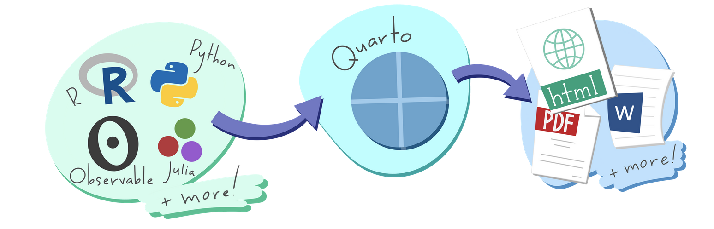

# Intro to quarto

Thank you to Nick Bearman for providing an early version of these slides.

- Presentation slides available @ [here](https://github.com/ericdelmelle/introToQuarto/tree/main/docs/index.html)
- qmd document the presentation is based off [here](https://github.com/ericdelmelle/introToQuarto/tree/main/presentation_nov5.qmd)
- intial qmd for the exercise [here](https://github.com/ericdelmelle/introToQuarto/tree/main/exercise.qmd)

## Requirements
- [Quarto](https://quarto.org/) (tested with version 1.3.321)
- [renv](https://rstudio.github.io/renv/articles/renv.html) (version 1.0.0)
- [R](https://www.r-project.org/) / [RStudio](https://posit.co/download/rstudio-desktop/) (recommended but not required)
